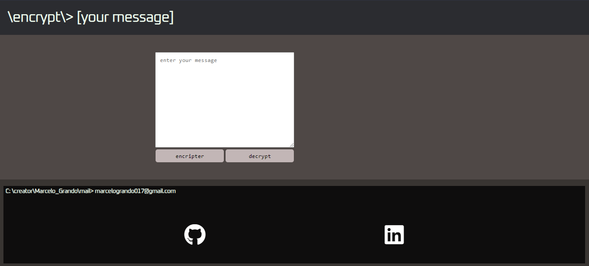

# CHALLENGE-ONE 

# Encrypt

### Vista en la Web

  

## Acerca del proyecto

Este proyecto este realizado puramente con Javascript, HTML y CSS. Está diseñado bajo las pautas propuestas por el curso ONE, es es parte del la primera parte de dicho curso. 

### Javascript

Contiene codigo JS puro, para las funcionalidades. Y maneja elementos dinimicos para mostrar el resultado de la encriptación del mensaje o su descifrado
  
### CSS

El diseño de la página es propio, está inspirado en una terminal.

### Visita la pagina web 

<a href="https://marcelo017.github.io/Encrypta/">encrypta</a>
